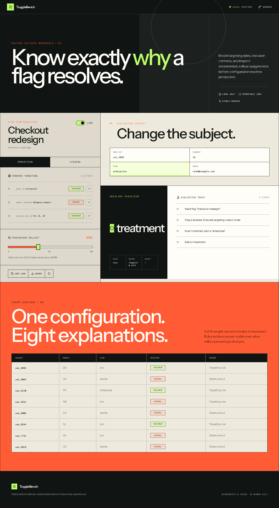

# ToggleBench

[](https://github.com/kyan9400/togglebench/actions/workflows/ci.yml)
[](https://github.com/kyan9400/togglebench/actions/workflows/deploy-pages.yml)
[](LICENSE)

A deterministic feature-flag workbench for designing targeting rules, testing user contexts, and understanding percentage rollouts before configuration reaches production.

**[Open the live workbench](https://kyan9400.github.io/togglebench/)**



## What it demonstrates

- ordered targeting rules with explicit precedence;
- stable percentage rollouts based on the flag key and subject key;
- a step-by-step evaluation trace for every decision;
- cohort exploration across representative users;
- independent production and staging configurations;
- versioned local persistence plus JSON copy and export;
- keyboard-accessible controls and reduced-motion support.

Everything runs locally in the browser. ToggleBench makes no API calls, loads no analytics, and sends no evaluation contexts to a server.

## Evaluation model

Each evaluation follows the same short pipeline:

1. Return the control variation when the flag is disabled.
2. Evaluate enabled targeting rules in order and return the first match.
3. Hash `flag-key:subject-key` into one of 10,000 stable buckets.
4. Return treatment when the bucket is inside the configured rollout; otherwise return control.

The FNV-1a hash is intentionally small and inspectable. It is appropriate for this deterministic simulator, but production flag platforms should use their documented bucketing algorithm to preserve SDK compatibility.

## Development

Requires Node.js 24+.

```bash
corepack enable
pnpm install
pnpm dev
```

Run the complete local gate:

```bash
pnpm lint
pnpm test
pnpm build
```

The test suite covers operator normalization, rule precedence, disabled flags, stable hashing, rollout distribution, versioned persistence, environment switching, and interactive rule controls. GitHub Actions repeats lint, tests, and a production build for every pull request.

## Architecture

Evaluation and persistence live in pure TypeScript modules under `src/lib`. React owns configuration and context state, derives decisions during render, and persists only the versioned flag document. The interface uses no charting or state-management dependency, keeping the runtime bundle compact and the decision path easy to audit.

## Release and rollback

Tags matching `v*` run the full gate, build the static site, and publish a compressed release artifact. GitHub Pages deploys only from a successful build of `main`. To roll back the live site, revert the responsible commit on `main`; the Pages workflow will redeploy the previous configuration.

## License

[MIT](LICENSE) © Hassan Ak
